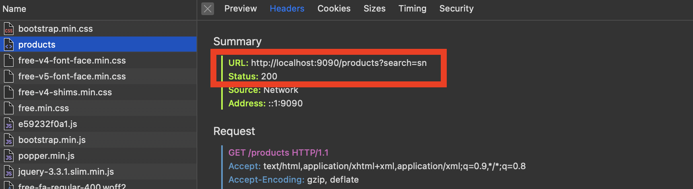
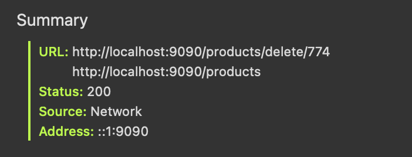
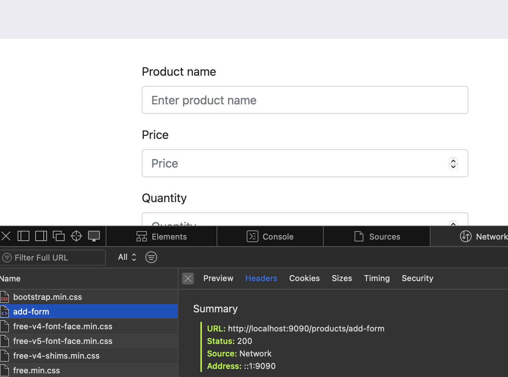
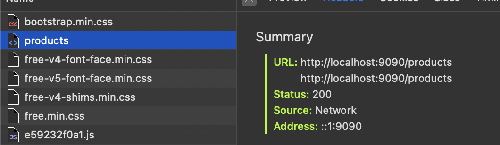
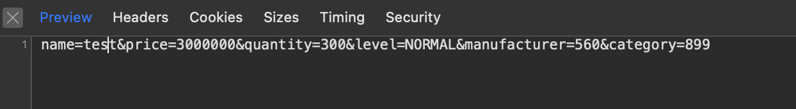
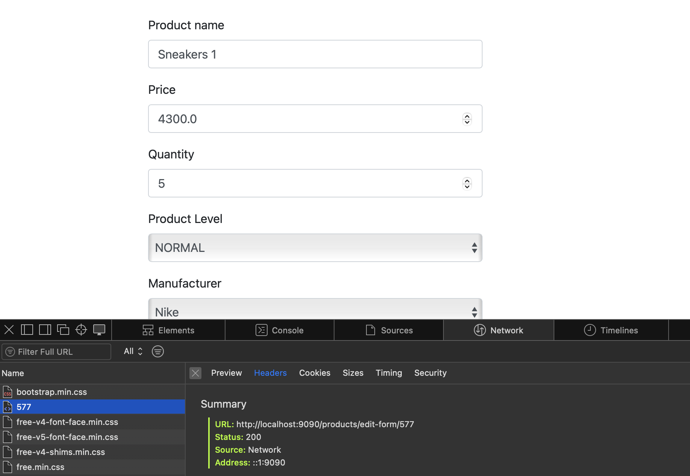
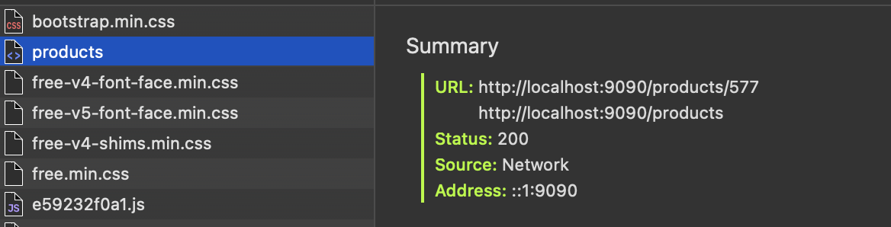
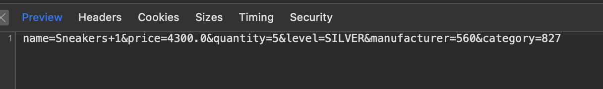

# Exercise 4 and 5 — Spring Boot MVC with full understanding of our Service Layer and DI

## 0) What We’ll Build (Our Plan)

1. **Domain model**

- We will add three new entities to the model:`Manufacturer`, `Product` and `ShoppingCart`.
- We will introduce enumerations within our entities and understand how we can handle them.

2. **In-memory storage**

- We will update our in-memory storage to store our new data.

3. **CRUD**

- We will understand CRUD and how to implement it for any entity.

4. **Repository**

- We will add all necessary repositories.
- In each repository we will support CRUD operations.

5. **Service**

- We will add necessary services.
- In each service we will support CRUD operations.

6. **Controller**

- We will introduce controllers as a substitute for servlets and implement them to support CRUD.

7. **Views (Thymeleaf)**:

- For each entity we will have one view for display and one for the form used to create/update.
- The `ShoppingCart` entity is an exception and will be handled accordingly.

Throughout the entire exercise we will explain and revise our crucial Spring concepts.
The goal in the end is to be able to implement an application with a couple of entities that have relationships between
them, and enable full CRUD functionalities for each entity.
---

## 1) Extending our model, understanding enumerations
- First, we extend our model to support our application.
- Since we plan to build a shop, naturally we need products and a shopping cart to be able to purchase some.
- We also have manufacturers and categories that describe our products.

- We can see that `Manufacturer` and `Category` have their own entity, i.e. a Java class that is holding some
  properties.
- However, sometimes we do not need such information, and we only have one property that can hold several values to
  store. In such case, we can use enumerations.
- In our example, we have `ProductLevel` describing the level for each product, and `ShoppingCartStatus` describing the
  status of each cart.
- The idea for the levels of products (as we mentioned in class) is to give us practise with more enumerations and makes
  less business logic meaning, although one can argue that products can be differentiated by level.
- The idea for cart status is much more real, and enables us to have later exactly 1 active (CREATED) `ShoppingCart` per
  user, and still store all the other CANCELED or FINISHED ones. Why? Well, we want to know when users disrupted their
  purchases and we might also want to run some statistics into their past purchases for recommendations, promotions etc.

Below are our newly added classes for the domain. They do have relationships between them.
Please think about their relationships, so that next class we can be prepared to understand our real-life database.

**`src/main/java/mk/ukim/finki/wp2025/model/Manufacturer.java`**
```java
import lombok.AllArgsConstructor;
import lombok.Data;

@Data
@AllArgsConstructor
public class Manufacturer {

    private Long id;
    private String name;
    private String address;

    public Manufacturer(String name, String address) {
        this.id = (long) (Math.random() * 1000);
        this.name = name;
        this.address = address;
    }
}
```

**`src/main/java/mk/ukim/finki/wp2025/model/Product.java`**
```java

@Data
@AllArgsConstructor
public class Product {

    private Long id;
    private String name;
    private Double price;
    private Integer quantity;
    private ProductLevel level;
    private Category category;
    private Manufacturer manufacturer;

    public Product(
            String name, Double price, Integer quantity, ProductLevel productLevel,
            Category category, Manufacturer manufacturer
    ) {
        this.id = (long) (Math.random() * 1000);
        this.name = name;
        this.price = price;
        this.quantity = quantity;
        this.level = productLevel;
        this.category = category;
        this.manufacturer = manufacturer;
    }
}
```

**`src/main/java/mk/ukim/finki/wp2025/model/ShoppingCart.java`**
```java

@Data
public class ShoppingCart {

    private Long id;
    private LocalDateTime dateCreated;
    private User user;
    private List<Product> products;
    private ShoppingCartStatus status;

    public ShoppingCart() {
        this.id = (long) (Math.random() * 1000);
    }

    public ShoppingCart(User user) {
        this.id = (long) (Math.random() * 1000);
        this.dateCreated = LocalDateTime.now();
        this.user = user;
        this.products = new ArrayList<>();
        this.status = ShoppingCartStatus.CREATED;
    }
}
```

**`src/main/java/mk/ukim/finki/wp2025/model/ProductLevel.java`**
```java
public enum ProductLevel {
    DISCOUNT, NORMAL, SILVER, GOLD
}

```

**`src/main/java/mk/ukim/finki/wp2025/model/ShoppingCartStatus.java`**
```java
public enum ShoppingCartStatus {
    CREATED,
    CANCELED,
    FINISHED
}
```

- Now let's recap, we want to implement CRUD functionalities for our entities,
  we know that this process will be different for the `ShoppingCart`, as it follows a different logic, but we will see
  what exactly will be different later.

- Before we move on to more complex things, we can just store this data in the `DataHolder`, as we did before, so let's
  do that first.

---

## 2) Storing our data
- We mentioned in class that until the day comes when we do indeed have a real database, we will use an in-memory
  storage that is supposed
  to mock our database. So that is what the `DataHolder` class does.

- So we add lists to store our data, and later in the code we instantiate them and add some items.

**`src/main/java/mk/ukim/finki/wp2025/model/ShoppingCartStatus.java`**
```java
    public static List<Manufacturer> manufacturers = null;
public static List<Product> products = null;
public static List<ShoppingCart> shoppingCarts = null;
```

**`src/main/java/mk/ukim/finki/wp2025/model/ShoppingCartStatus.java` inside the `init()` method**
```java
    manufacturers =new ArrayList<>();
    manufacturers.add(new Manufacturer("Mango", "Spain"));
       
    products =new ArrayList<>();
    products.add(new Product("Sneakers 1", 4300.00,5,ProductLevel.NORMAL, categories.get(2),manufacturers.get(1)));

    shoppingCarts =new ArrayList<>();
```

## 3) CRUD
- Now, we come to the point where we first need to understand what CRUD is and how we want to implement it.
- CRUD means Create, Read, Update, Delete, and is detailed into the following table.

 CRUD   | Method                                            | Meaning                   |
|--------|---------------------------------------------------|---------------------------|
| Create | POST handler method                               | Add new data              |
| Read   | GET handler method                                | Retrieve and display data |
| Update | PUT or PATCH handler method - we can also do POST | Modify existing data      |
| Delete | DELETE handler method - we can also do POST       | Remove data               |

- So, we are clear what we need to achieve to have CRUD, but how?
- Let's think. If we take READ for example, we say that we need to be able to retrieve and display data. Okay, retrieve
  from where? Display how and where?
- The place that stores our data is our database (even though in our case it is a mock in-memory database). So, we need
  to retrieve the data from there.
- The place that can display data is a view, since we have a Spring MVC application following the MVC pattern. (Recall
  difference between API and MVC app from first class)
- Okay, but now how do we get the data between there two? As we can recall, they don't directly communicate and shouldn'
  t.
- If we recall our first lecture, we said we are using the so-called Onion Architecture in our app, thus we have layers,
  and so our data will flow between them top -> bottom (when we get the request) and bottom -> top (when we return a
  response).
- So, it is clear that we need to implement all layers i.e. a repository, service, and servlet/controller per entity we
  want to implement CRUD for.

#### First way to do this
- Recall our last class, once we implemented everything bottom -> top for one entity, i believe `Product`.
- This means, we created `ProductRepository` interface and its implementation,
  `ProductService` and its implementation, and finally a `ProductController` and a matching view to display the data
  `products.html`.

#### Second/Better way to do this
- We said that the better way to implement everything is as needed, i.e. we tried a different approach for
  `Manufacturer`.
- This means we start with one functionality like READ, and implement that through all layers, then we continue with
  DELETE etc.

#### Disclaimer
- Now, going on, we will see what is needed layer by layer for the simplicity of this text, and to be able to understand
  DI and other concepts better.
- Still, when implementing, we encourage you try to implement functionality by functionality, end-to-end.

## 4) Repository layer
- In this layer we added a repository for each entity, i.e. `ManufacturerRepository`, `ProductRepository` and
  `ShoppingCartRepository`.
- For simplicity, in this text we will show the `Product` CRUD and the `ShoppingCart` functionalities, because the implementation for 
`Manufacturer` and `Category` is the same as one for `Product` (even easier since they do not have relations within them). The full code is available within this project.

**`src/main/java/mk/ukim/finki/wp2025/repository/ProductRepository.java`**
```java
    public interface ProductRepository {

    Optional<Product> findById(Long id);

    Product save(Product product);

    List<Product> findAll();

    List<Product> search(String text);

    void delete(Long id);
}  
```

**`src/main/java/mk/ukim/finki/wp2025/repository/InMemoryProductRepositoryImpl.java`**
```java
@Repository
public class InMemoryProductRepositoryImpl implements ProductRepository {

    @Override
    public Optional<Product> findById(Long id) {
        return DataHolder.products.stream()
                                  .filter(product -> product.getId().equals(id))
                                  .findFirst();
    }

    @Override
    public Product save(Product product) {
        DataHolder.products.removeIf(m -> m.getId().equals(product.getId()));
        DataHolder.products.add(product);
        return product;
    }

    @Override
    public List<Product> findAll() {
        return DataHolder.products;
    }

    @Override
    public List<Product> search(String text) {
        return DataHolder.products.stream().filter(p -> p.getName().toLowerCase().contains(text.toLowerCase())
                                 || p.getLevel().toString().toLowerCase().contains(text.toLowerCase())
                                 || p.getCategory().getName().toLowerCase().contains(text.toLowerCase())
                                 || p.getManufacturer().getName().toLowerCase().contains(text.toLowerCase()))
                                  .toList();
    }

    @Override
    public void delete(Long id) {
        DataHolder.products.removeIf(m -> m.getId().equals(id));
    }
}
```
#### Normal CRUD for `Product`
- As we can see, we have two methods for the READ part of the CRUD, i.e. `List<Product> findAll()` and `Optional<Product> findById()`.
- Then, we have `void delete(Long id)` for DELETE.
- We have `Product save(Product product)` for both CREATE and UPDATE.
We have to note here that our current implementation of this method is not truly the best alternative, but we will use it until we can
connect to a real database. Then, we will not have the process of always treating the UPDATE as a CREATE action.
- One more thing we have, that is not truly a part of the CRUD, is `List<Product> search(String text)`. We try to find the text we search in all 
possible properties relating to the `Product`, i.e. a full-text search.

#### `ShoppingCart` is different
- Why? Well, simply because we are more interested in implementing ADD PRODUCT TO CART and CREATE AND SHOW CART FOR USER functionalities.
This means we want to have a cart created for each user, and that is the active one, until the user cancels it or goes through with the sale and thus closes it.
Then, we want to enable the user to add items into the cart (later, we can try to implement remove etc., now we stick with add only).
- So, now, to implement these functionalities, we have the following code.

**`src/main/java/mk/ukim/finki/wp2025/repository/ShoppingCartRepository.java`**
```java
public interface ShoppingCartRepository {

    Optional<ShoppingCart> findById(Long id);

    Optional<ShoppingCart> findByUsernameAndStatus(String username, ShoppingCartStatus status);

    ShoppingCart save(ShoppingCart shoppingCart);
}
```

**`src/main/java/mk/ukim/finki/wp2025/repository/InMemoryShoppingCartRepositoryImpl.java`**
```java
@Repository
public class InMemoryShoppingCartRepositoryImpl implements ShoppingCartRepository {

    public Optional<ShoppingCart> findById(Long id) {
        return DataHolder.shoppingCarts.stream().filter(i -> i.getId().equals(id)).findFirst();
    }

    public Optional<ShoppingCart> findByUsernameAndStatus(String username, ShoppingCartStatus status) {
        return DataHolder.shoppingCarts.stream()
                                       .filter(i -> i.getUser().getUsername().equals(username)
                                               && i.getStatus().equals(status))
                                       .findFirst();
    }

    public ShoppingCart save(ShoppingCart shoppingCart) {
        DataHolder.shoppingCarts.removeIf(i -> i.getUser().getUsername().equals(shoppingCart.getUser().getUsername()));
        DataHolder.shoppingCarts.add(shoppingCart);
        return shoppingCart;
    }
}
```

- A quick detour here, would be to mention that we always use our annotations, to make sure Spring sees our components. Recall this concept from previous classes.

## 5) Service layer
- We can recall from previous classes that the service layer is here to represent our business logic.
- Now, let's look at what we have in our `ProductService`. Again, the code for `ManufacturerService` is similar and given in the repo.

**`src/main/java/mk/ukim/finki/wp2025/service/ProductService.java`**
```java
public interface ProductService {

    Product findById(Long id);

    Product create(
            String name,
            Double price,
            Integer quantity,
            ProductLevel level,
            Long categoryId,
            Long manufacturerId
    );

    Product update(
            Long id,
            String name,
            Double price,
            Integer quantity,
            ProductLevel level,
            Long categoryId,
            Long manufacturerId
    );

    List<Product> findAll();

    List<Product> search(String text);

    void delete(Long id);
}
```

- We can notice that the service holds similar methods to those we had in the `ProductRepository`. 
- However, the major difference is in the fact that here we have a separate method for CREATE and UPDATE, that comes from our need
to have the `id` of the property when we want to update an entity. If we don't know what to update, we can't update :)

- Okay, let's now see the implementation of this service.

**`src/main/java/mk/ukim/finki/wp2025/service/ProductServiceImpl.java`**
```java
@Service
public class ProductServiceImpl implements ProductService {

    private final ProductRepository productRepository;
    private final ManufacturerService manufacturerService;
    private final CategoryService categoryService;

    public ProductServiceImpl(
            ProductRepository productRepository,
            ManufacturerService manufacturerService,
            CategoryService categoryService
    ) {
        this.productRepository = productRepository;
        this.manufacturerService = manufacturerService;
        this.categoryService = categoryService;
    }

    @Override
    public Product findById(Long id) {
        return productRepository.findById(id).orElseThrow(() -> new ProductNotFoundException(id));
    }

    @Override
    public Product create(
            String name,
            Double price,
            Integer quantity,
            ProductLevel level,
            Long categoryId,
            Long manufacturerId
    ) {

        Category category = categoryService
                .findById(categoryId);

        Manufacturer manufacturer = manufacturerService
                .findById(manufacturerId);

        Product product = new Product(name, price, quantity, level, category, manufacturer);
        return productRepository.save(product);
    }

    @Override
    public Product update(
            Long id,
            String name,
            Double price,
            Integer quantity,
            ProductLevel level,
            Long categoryId,
            Long manufacturerId
    ) {

        Product product = findById(id);

        Category category = categoryService
                .findById(categoryId);

        Manufacturer manufacturer = manufacturerService
                .findById(manufacturerId);

        product.setName(name);
        product.setPrice(price);
        product.setQuantity(quantity);
        product.setLevel(level);
        product.setCategory(category);
        product.setManufacturer(manufacturer);

        return productRepository.save(product);
    }

    @Override
    public List<Product> findAll() {
        return productRepository.findAll();
    }

    @Override
    public List<Product> search(String text) {
        return productRepository.search(text);
    }

    @Override
    public void delete(Long id) {
        productRepository.delete(id);
    }
}
```
- The first thing we notice here is that this implementation depends on `ProductRepository`, `ManufacturerService` and `CategoryService`.
- And now we get to fully explain this dependence.

#### Dependency Injection (DI) and Inversion of Control (IOC) - Core concept in the Spring Boot Framework
##### IOC 
- We explained IOC in classes way back, saying that Spring takes parts of our job and does them for us, therefore the control
is not with us as programmers but with the framework itself.
  - Here is a more formal explaination: 
  Inversion of Control (IoC) is a fundamental principle in software design where the 
  control of object creation and dependency management is inverted from the developer to a framework or container.
  In traditional programming, the developer manually creates and manages the lifecycle of objects using new. 
  With IoC, the framework controls when and how objects are created, configured, and destroyed.
  This inversion shifts the “control flow” of the program — the developer only defines what components exist and how they relate, 
  while the IoC container decides how to build and connect them.

- Why does it matter? 
  - Loose coupling between classes — objects depend on abstractions rather than specific implementations.
  - Flexibility — components can easily be replaced, extended, or tested independently.
  - Centralized configuration — the container manages all objects and their dependencies consistently.
  - Cleaner architecture — responsibilities are separated; classes focus on logic rather than resource management.

- Spring Boot’s IoC Container is responsible for:
  - Discovering classes that should be managed (via annotations such as @Component, @Service, etc.).
  - Creating instances of those classes (known as beans).
  - Managing their lifecycle (initialization, dependency resolution, destruction).
  - Injecting the required dependencies between beans automatically.
  - This mechanism enables you to focus on business logic instead of boilerplate code for creating and wiring objects.

##### DI
- Dependency Injection (DI) is the specific technique used to implement Inversion of Control.
- It means that an object (class) does not create its own dependencies — instead, they are supplied or “injected” 
from the outside by the container.
- So, if one class depends on another, it doesn’t instantiate it directly; the framework provides it automatically.
- DI ensures that each class declares what it needs, and the framework provides those dependencies at runtime.

- The injection can occur through:
  - Constructor parameters
  - Setter methods
  - Direct field injection

- So, now we can say we truly understand how we depend on other services and repositories. We have to note here that this concept
remains the same in all classes, for example when we implement controllers next, we will depend on some services and that again is
achieved in the same manner.

- We should also see the `ShoppingCart` service layer functionality, as a more complex one.
**`src/main/java/mk/ukim/finki/wp2025/service/ShoppingCartService.java`**
```java
public interface ShoppingCartService {

    List<Product> listAllProductsInShoppingCart(Long cartId);

    ShoppingCart getActiveShoppingCart(String username);

    ShoppingCart addProductToShoppingCart(String username, Long productId);
}
```

**`src/main/java/mk/ukim/finki/wp2025/service/ShoppingCartServiceImpl.java`**
```java
@Service
public class ShoppingCartServiceImpl implements ShoppingCartService {

    private final ShoppingCartRepository shoppingCartRepository;
    private final UserRepository userRepository;
    private final ProductService productService;

    public ShoppingCartServiceImpl(
            ShoppingCartRepository shoppingCartRepository,
            UserRepository userRepository,
            ProductService productService
    ) {
        this.shoppingCartRepository = shoppingCartRepository;
        this.userRepository = userRepository;
        this.productService = productService;
    }

    @Override
    public List<Product> listAllProductsInShoppingCart(Long cartId) {
        if (this.shoppingCartRepository.findById(cartId).isEmpty())
            throw new ShoppingCartNotFoundException(cartId);
        return this.shoppingCartRepository.findById(cartId).get().getProducts();
    }

    @Override
    public ShoppingCart getActiveShoppingCart(String username) {
        return this.shoppingCartRepository
                .findByUsernameAndStatus(username, ShoppingCartStatus.CREATED)
                .orElseGet(() -> {
                    User user = this.userRepository.findByUsername(username)
                                                   .orElseThrow(() -> new UserNotFoundException(username));
                    ShoppingCart shoppingCart = new ShoppingCart(user);
                    return this.shoppingCartRepository.save(shoppingCart);
                });
    }

    @Override
    public ShoppingCart addProductToShoppingCart(String username, Long productId) {
        ShoppingCart shoppingCart = this.getActiveShoppingCart(username);
        Product product = this.productService.findById(productId);
        if (shoppingCart.getProducts()
                        .stream().anyMatch(i -> i.getId().equals(productId)))
            throw new ProductAlreadyInShoppingCartException(productId, username);
        shoppingCart.getProducts().add(product);
        return this.shoppingCartRepository.save(shoppingCart);
    }
}
```
- The idea implemented here is to be able to find the CREATED shopping cart for the user that is currently logged in, else if not created we create it.
- Then, we enable adding items into the shopping cart.
- We can also see current items in the shopping cart that is active for that user.

## 6) Controllers (Web layer)
- Now, let us finally formally introduce controllers.

#### Servlets vs Controllers
- In traditional Java web development, servlets were used to handle HTTP requests and responses manually. 
While this approach works, it quickly becomes complex, repetitive, and hard to maintain when you have many endpoints.
- Spring Boot introduces a higher-level abstraction called a Controller, which simplifies this process dramatically.

#### Controllers 
- A Controller in Spring Boot is a special class that handles incoming HTTP requests, processes them 
(probably with the help of services), and returns a response.
- It plays the same role as a servlet — it receives and responds to web requests — but Spring handles all the low-level work (like request parsing, routing, and response creation).
- We annotate them with `@Controller` to enable the MVC pattern. We will discuss `@RestController` and APIs in another exercise.

#### How do controllers work?
- When you run a Spring Boot web application:
    - The framework starts an embedded web server (Tomcat).
    - It scans your code for classes annotated with `@Controller` (or `@RestController`).
    - Each method in those classes that has annotations like `@GetMapping`, `@PostMapping`, etc. is registered as a request handler. So from now on, when we say 'handler' you should know exactly what we mean.
    - When an HTTP request comes in, Spring finds the right controller method based on the URL and HTTP method, runs it, and returns the result.


- We will see now the `ProductController` and how it works. The remaining controllers are all available in the code repo and follow all the same principles.

**`src/main/java/mk/ukim/finki/wp2025/web/controller/ProductController.java`**
```java
@Controller
@RequestMapping("/products")
public class ProductController {

    private final ProductService productService;
    private final CategoryService categoryService;
    private final ManufacturerService manufacturerService;

    public ProductController(
            ProductService productService,
            CategoryService categoryService,
            ManufacturerService manufacturerService
    ) {
        this.productService = productService;
        this.categoryService = categoryService;
        this.manufacturerService = manufacturerService;
    }

    @GetMapping()
    public String getProductPage(
            @RequestParam(required = false) String error,
            @RequestParam(required = false) String search,
            Model model
    ) {
        if (error != null) {
            model.addAttribute("error", error);
        }

        List<Product> products;
        if (search != null && !search.isEmpty())
            products = productService.search(search);
        else
            products = productService.findAll();

        model.addAttribute("products", products);
        return "products";
    }

    @PostMapping("/delete/{id}")
    public String deleteProduct(@PathVariable Long id) {
        productService.delete(id);
        return "redirect:/products";
    }


    @GetMapping("/edit-form/{id}")
    public String editProductPage(@PathVariable Long id, Model model) {
        model.addAttribute("product", productService.findById(id));
        model.addAttribute("levels", ProductLevel.values());
        model.addAttribute("categories", categoryService.listCategories());
        model.addAttribute("manufacturers", manufacturerService.findAll());
        return "product-form";
    }

    @GetMapping("/add-form")
    public String addProductPage(Model model) {
        model.addAttribute("levels", ProductLevel.values());
        model.addAttribute("categories", categoryService.listCategories());
        model.addAttribute("manufacturers", manufacturerService.findAll());
        return "product-form";
    }

    @PostMapping
    public String saveProduct(
            @RequestParam String name,
            @RequestParam Double price,
            @RequestParam Integer quantity,
            @RequestParam ProductLevel level,
            @RequestParam Long category,
            @RequestParam Long manufacturer
    ) {
        productService.create(name, price, quantity, level, category, manufacturer);
        return "redirect:/products";
    }

    @PostMapping("/{id}")
    public String updateProduct(
            @PathVariable Long id,
            @RequestParam String name,
            @RequestParam Double price,
            @RequestParam Integer quantity,
            @RequestParam ProductLevel level,
            @RequestParam Long category,
            @RequestParam Long manufacturer
    ) {
        productService.update(id, name, price, quantity, level, category, manufacturer);
        return "redirect:/products";
    }
}
```

- Let's discuss the controller implementation in details.

#### `@Controller`
- Marks this class as a Spring MVC Controller.
- Spring Boot automatically detects it (during component scanning) and registers it as a bean inside the IoC container.
- It tells Spring that the methods inside will handle web requests and return view names (Thymeleaf templates).

#### @RequestMapping("/products")
- Defines the base URL path for this controller.
- That means every method inside will handle URLs that start with /products.

#### Endpoints
| HTTP | Path                        | Purpose            |
|------|-----------------------------|--------------------|
| GET  | `/products`                 | List all products  |
| GET  | `/products/add-form`        | Show create form   |
| GET  | `/products/edit-form?id=ID` | Show edit form     |
| POST | `/products`                 | Create new product |
| POST | `/products/{id}`            | Update product     |
| POST | `/products/delete/{id}`     | Delete product     |

#### @GetMapping() - URL: /products
- Purpose: Shows the list of products (the main page).
- Parameters:
  - @RequestParam(required = false) String error – reads query parameter error if it exists (e.g., /products?error=Something).
  - @RequestParam(required = false) String search – reads optional search text.
  - Model model – used to pass data to the view (like products, error, etc.).
- Behaviour:
  - If there is a search term, it filters products; otherwise, it shows all.
  - Finally, it returns "products" — this is the name of the HTML template that will be rendered.
  - So there’s one view template named `products.html` for listing all products.

#### @PostMapping("/delete/{id}") - URL: /products/delete/{id}
- Purpose: Deletes the product with the given ID.
- Parameters:
  - @PathVariable Long id – reads the product ID from the URL (e.g., /products/delete/5).
- Behaviour:
  - Calls the service layer to delete the product with that ID.
  - After deletion, it redirects the user back to the main product list page using "redirect:/products".
  - This avoids reloading the delete endpoint and updates the visible list of products.

#### @GetMapping("/edit-form/{id}") URL: /products/edit-form/{id}
- Purpose: Opens the edit form for an existing product.
- Parameters:
  - @PathVariable Long id – reads the product ID from the URL to load its current data.
  - Model model – used to pass data to the view (like product, categories, etc.).
- Behaviour:
  - Loads the product that should be edited.
  - Adds it to the model so the form fields can be pre-filled with its data.
  - Also adds levels, categories, and manufacturers to populate dropdowns.
  - Returns "product-form" — the template that displays the edit form.


#### @GetMapping("/add-form") URL: /products/add-form
- Purpose: Opens the form for adding a new product.
- Parameters:
  - Model model – used to send lists like levels, categories, and manufacturers to the view.
- Behaviour:
  - Adds levels, categories, and manufacturers to the model for dropdown options.
  - Returns "product-form" — the same template used for editing, but this time the form fields are empty for creating a new product.
  - So both add and edit use the same view template product-form.html.

#### @PostMapping URL: /products
- Purpose: Handles the submission of the Add Product form.
- Parameters:
  - @RequestParam String name – product name.
  - @RequestParam Double price – product price.
  - @RequestParam Integer quantity – product quantity.
  - @RequestParam ProductLevel level – product level (enum).
  - @RequestParam Long category – selected category ID.
  - @RequestParam Long manufacturer – selected manufacturer ID.
- Behaviour:
  - Calls the service layer to create a new product with the given form data.
  - Redirects back to /products after saving, showing the updated list.

#### @PostMapping("/{id}") URL: /products/{id}
- Purpose: Handles the submission of the Edit Product form.
- Parameters:
  - @PathVariable Long id – product ID to update.
  - @RequestParam String name – updated name.
  - @RequestParam Double price – updated price.
  - @RequestParam Integer quantity – updated quantity.
  - @RequestParam ProductLevel level – updated product level.
  - @RequestParam Long category – updated category ID.
  - @RequestParam Long manufacturer – updated manufacturer ID.
- Behaviour:
  - Calls the service layer to update the existing product with new data.
  - Redirects back to /products to show the refreshed product list.

#### Important note
- We need one template to display the items, and that template holds the buttons that enable us to either go to the form for ADD or EDIT, or immediately DELETE an item.
- We need another template that holds the form that does the actual ADDING / UPDATING triggered on submit of its button.

- Let's now see these templates.

## 7) Views
- We will view the flow for the `Product`, but again it is the same (or easier) for the other entities, and all code is available in the code repo.
- We have two templates, `products.html` and `product-form.html`.

- Let's look at the first one, i.e. the template used to show the products. 
- We will look at this template part by part, skipping the top-most styles, and the header. They are already explained before, and not important to our logic here. The goal now is to fully understand each piece of the puzzle enabling us to have CRUD for each entity.
**`src/main/resources/templates/products.html`**
```html
<form class="form-inline my-2 my-lg-0" action="products" method="GET">
    <div class="input-group input-group-sm">
        <input name="search" type="text" class="form-control" aria-label="Small"
               aria-describedby="inputGroup-sizing-sm"
               placeholder="Search...">
        <div class="input-group-append">
            <button type="submit" class="btn btn-secondary btn-number">
                <i class="fa fa-search"></i>
            </button>
        </div>
    </div>
</form>
```
- This part of the `products.html` allows us to have the top search bar. It is important to note that this form has its own SUBMIT button but does not do a POST request, but rather a GET.
- Why? Because we want the GET handler in the `ProductController.java` to respond when we want to list all products, 
but also when we want to show a filtered a list of products (Now would be a good time to scroll back and find again the `ProductController` to confirm and understand).
- The important thing to never forget with forms is that the 'name' attribute of the input fields must match the `@RequestParam` request 
parameters i.e. their name. 

- And finally, we always test our implementation. As we said before, we implement functionality by functionality, one at a time, and test each one
by running the main Application class in DEBUG mode, viewing the results in browser and if needed, inspecting (right click -> Inspect Element) the requests 
(Friendly advice is to always do this in the beginning, so that you can learn more and understand better, as we do in classes).





- Now, let's see what else we have in this template.
**`src/main/resources/templates/products.html`**
```html
<div class="container mb-4">
        <div class="row">
            <div class="col-12" th:if="${products.size() > 0}">
                <div class="table-responsive">
                    <table class="table table-striped">
                        <thead>
                        <tr>
                            <th scope="col">Product name</th>
                            <th scope="col">Price</th>
                            <th scope="col">Level</th>
                            <th scope="col">Manufacturer</th>
                            <th scope="col">Category</th>
                        </tr>
                        </thead>
                        <tbody>
                        <tr th:each="product : ${products}" class="product">
                            <td th:text="${product.getName()}"></td>
                            <td th:text="${product.getPrice()}"></td>
                            <td th:text="${product.getLevel().name()}"></td>
                            <td th:text="${product.getManufacturer() != null}
                            ? ${product.getManufacturer().getName()} : 'No Manufacturer'"></td>
                            <td th:text="${product.getCategory() != null}
                            ? ${product.getCategory().getName()} : 'No Category'"></td>
                            <td class="text-right">
                                <th:block>
                                    <form th:action="@{'/products/delete/{id}' (id=${product.getId()})}"
                                          th:method="DELETE">
                                        <button type="submit"
                                                class="btn btn-sm btn-danger delete-product">
                                            <i class="fa fa-trash">Delete</i>
                                        </button>
                                    </form>
                                </th:block>
                                <th:block>
                                    <a th:href="@{'/products/edit-form/{id}' (id=${product.getId()})}"
                                       class="btn btn-sm btn-info edit-product">
                                        <i class="fa fa-trash">Edit</i>
                                    </a>
                                </th:block>
                                <form th:action="@{'/shopping-cart/add-product/{id}' (id=${product.getId()})}"
                                      th:method="POST">
                                    <button type="submit" class="btn btn-sm btn-primary"><i class="fa fa-trash">Add
                                        product
                                        to cart</i></button>
                                </form>
                            </td>
                        </tr>
                        </tbody>
                    </table>
                </div>
            </div>
            <div class="col mb-3">
                <div class="row">
                    <div class="col-sm-12 col-md-12">
                        <a href="/products/add-form" class="btn btn-block btn-dark add-product-btn">
                            Add new product
                        </a>
                    </div>
                </div>
            </div>
        </div>
    </div>
</div>
```

#### Manage display when no entities
- This part has a lot of things that we need to explain, so we'll go step by step. 
- First thing, we have `th:if="${products.size() > 0}"` that we use to conditionally display whatever the content inside, in our case the table of products.
We have seen this command before, and it will be very common for us to use it in this specific use case.

- Next, we can notice that the table is filled such that each row will be one product, having all its details. As we did in classes, you can always go
back to the model class to see what needs to be shown. In the exam, you will also be told what properties should be shown (most likely all).

#### Display the entities
- Now, we have `<tr th:each="product : ${products}">`. This command enables us to go through all products `${products}`, and use the `product`
as a reference for each of the products. If we have for instance `<tr th:each="p : ${products}">`, then later we will access `p` when we want to get
each product. Please note that the name of the reference is completely up to you (should make sense for code clarity), however the `${products}`
must match exactly the data given to the template when it is rendered. 
This data we put into the `Model`, and you can find this line `model.addAttribute("products", products);` of code in the `ProductController.java`
in the first GET request handler, that serves this page. If the code was written like this `model.addAttribute("ppp", products);`, 
then in the template we would have `<tr th:each="product : ${ppp}">`.

- Next, for each attribute of the entity, in this case the product, we have `<td th:text="${product.getName()}"></td>` code like this, using
a different GETTER method for each property accordingly. We can use these simple GETTER methods for all properties of the entity that 
are a string or any kind of number, even a boolean. 
- **Note**: For a boolean variable the GETTER method is written as isT() instead of getT(). If you forget this, no big deal, make sure to
always think when programming, you can always go to the model class and see inside what method to use (even IntelliJ should suggest them).
- Now, when we have to display an enumeration, we have a bit of a difference, since we want to display the value of the enumeration.
We do this by using `.name()` on the enumeration (as done in our case for `ProductLevel`).
- Finally, the most challenging ones will be the full objects, i.e. when the property of the entity is an entity itself. For instance, our product has a manufacturer and a category.
To make sure we don't try to access unexisting objects, we use this ternary operator syntax `<td th:text="${product.getManufacturer() != null} ? ${product.getManufacturer().getName()} : 'No Manufacturer'"></td>`. 
This code checks if the manufacturer exists first, then if true displays their name, else some string we hardcoded.
- The same is done for the category and will be done for all properties of such type.

#### Handling the DELETE form
- Next, we see the DELETE form. The important thing in it is to have the correct ACTION and METHOD. Here are ours `th:action="@{'/products/delete/{id}' (id=${product.getId()})}" th:method="DELETE"`. 
- The syntax used for the `th:action` allows us to have the `id` in our path, so it will be a `@PathVariable` in the appropriate `@PostMapping("/delete/{id}")` in the `ProductController`.
- Other than that, this form is quite simple, having only one button and nothing else. 
- Below you can see the request from our browser, when the DELETE button is clicked. We can see two consecutive requests, why? Now would be the time to go 
to the `ProductController` and check. Do you see the redirect? So, that's why we have two requests, because of `return "redirect:/products";` in the handler method.
- So again, what it does is, first a POST request to delete the product with the appropriate id, and then GET request for the products page.




#### Handling ADD and EDIT 
- Now, we come to the most complex part. We did our READ and DELETE parts of the CRUD with only one template. But for the CREATE and UPDATE
we need to have some sort of form that has multiple fields the user can enter/alter the data in. 
- We solve this using a second template for the add/edit form itself. Why do we say add/edit? Well, we will use one form for both. You could
use two separate forms, but our design choice is to use one, and you will need to do it with one form in the exam too.
- Before seeing this famous form, we need to see how we can get to it.
- In our table, we have the DELETE button, as shown before, but we also have an EDIT button right next to it, present in each row of the table.
Why in each row? Because both EDIT (UPDATE) and DELETE actions refer to a specific object that needs to be changed or deleted.
- We can see we have a simple link `<a th:href="@{'/products/edit-form/{id}' (id=${product.getId()})}">` to get us to the editing page (the famous form of ours).
- Why do we need the `id` then, if we just go to the form? Well, when we get to that form, that form needs to know if the action is ADD or EDIT but also, if EDIT, then which entity is the one being edited.
Why? Because we want to show the user **the current properties of the object being updated**. This is crucial, and a mistake commonly made by students in the exam, make sure not to forget this part.
- As for the ADD button, it is the same as the EDIT one, with two differences - first, it is placed outside the table as we only need one, and second, the `th:href` has a link that doesn't need an `id` property.
Why? Well, if we are adding a new object, that one has no `id` assigned to it yet.

- Now, let's see the famous form for adding or editing. 

**`src/main/resources/templates/product-form.html`**
```html
<form method="post" th:action="@{${product != null} ? '/products/' + ${product.id} : '/products'}">
    <div>
        <label for="name">Product Name</label>
        <input type="text"
               id="name"
               name="name"
               th:value="${product != null ? product.name : ''}"
               required>
    </div>

    <div>
        <label for="price">Price</label>
        <input type="number"
               id="price"
               name="price"
               th:value="${product != null ? product.price : ''}"
               required>
    </div>

    <div>
        <label for="quantity">Quantity</label><br/>
        <input type="number"
               id="quantity"
               name="quantity"
               th:value="${product != null ? product.quantity : ''}"
               min="1"
               required>
    </div>

    <div>
        <label for="level">Level</label><br/>
        <select id="level" name="level" required>
            <option th:each="l : ${levels}"
                    th:value="${l}"
                    th:text="${l.name}"
                    th:selected="${product != null && product.level != null && product.level == l}">
        </select>
    </div>

    <div>
        <label for="category">Category</label><br/>
        <select id="category" name="category" required>
            <option th:each="category : ${categories}"
                    th:value="${category.id}"
                    th:text="${category.name}"
                    th:selected="${product != null && product.category != null && product.category == category}">
        </select>
    </div>

    <div>
        <label for="manufacturer">Manufacturer</label><br/>
        <select id="manufacturer" name="manufacturer" required>
            <option th:each="manufacturer : ${manufacturers}"
                    th:value="${manufacturer.id}"
                    th:text="${manufacturer.name}"
                    th:selected="${product != null && product.manufacturer != null && product.manufacturer == manufacturer}">
        </select>
    </div>

    <button id="submit" type="submit">Submit</button>
    <a id="back" href="/products" type="button" class="btn btn-primary">Back to Products</a>
</form>
```

- First, we notice the method that is POST.
- Second thing to notice is the somewhat complex `th:action="@{${product != null} ? '/products/' + ${product.id} : '/products'}"` that is one 
of the things students often mistake in exams. So, let's take special care to understand it. 
We evaluate the expression `${product != null}` so that if it is true we go to `/products/{id}`, which is achieved by this part of the code
`'/products/' + ${product.id}`. Okay, but why? Well, again, go to see the `ProductController` again. Hint: now you need to look at the `@PostMapping` methods
for both CREATE and UPDATE. What can you notice? We essentially have the same path for both, just that the UPDATE had an `id` as
a `@PathVariable`. So, if this form gets a product passed to it, that signals that we are trying to UPDATE it, and product is not null, so
the path will be exactly the one we need for UPDATE.
- Now, you might say, wait how do we have a product passed to the form? Well, again, back to the `ProductController`.
Ask yourself this, which methods serve this form? `editProductPage` and `addProductPage` right? So the `Model model` that they have
is the one passed to the `product-from` template, and in it we can put all the data we need to access in that template i.e. the form.
- For now, make sure to notice that in the `editProductPage` we add the product we want to edit, so that the form can access it. Now, the complex
`th:action` should make sense. One more thing, `"@{}"` is used to evaluate the expression in Thymeleaf.

#### Handling simple data
- Now, think about what we did in classes, can you recall the way we separate the properties of the entity, as we handle some of them in the 
same manner. Remember, we used to copy-paste the input fields for strings, numbers, booleans.
- Let's look into the very first `<div>` inside the form. It is supposed to show the product name. The first important thing put is
to have the `name` attribute correctly, i.e. matching the name of the `@RequestParam` in the appropriate `@PostMethod` handler in the
controller. Because we use the same form for both ADD and EDIT, both methods `saveProduct` and `updateProduct` will have the same names 
for their request parameters to match the form. So, if in the controller the first `String` was called `t`, then in the form you would have 
`name="t'` etc. 
- Another thing to note is the `th:value="${product != null ? product.name : ''}"` which we can also write as 
`th:value="${product?.name}"`. Why do we have this? Again, recall our use-case, if we EDIT, we have a product and we need to show the user 
the **current** name of the product they edit, else if we ADD the field should be empty.
- You can use the same approach for all simple data, as we mentioned.

### Handling data that requires us to have a select i.e. enumerations or relationships
- For the more complex data, we need to show the user options of what they can put in. Why? Well this more complex data covers
enumerations and relationships, meaning in our case the `ProductLabel`, `Manufacturer` and `Category`.
- Now, we could let the user input whatever they want into the `ProductLabel` but then it may not match our current labels and then 
how would we handle this? Or even more scary, imagine letting the user (that is not some sort of ADMIN) decide for us that they want to 
add a new category. This is a learning example, so no big deal, but the point here is to show you a smart way to handle user input without 
needing a lot of validations. Of course, there's no one size fits all solution, but it is good for you to know this.
- So, if we understand our use case, it is clear that we need to pass the manufacturers, categories, and labels to the `product-from` template, 
so that we can in it list them for the user to choose. Again, go back to the `ProductController` in `editProductPage` and `addProductPage` methods 
and confirm that we indeed do this.
- Next, in the actual form i.e. `product-from` template we have three blocks that are esentially the same, one for labels, one for manufacturers and one categories.
So, we have three selects. 
- First most important thing, again, is to have the `name` attribute of the `<select>` match the appropriate `@RequestParam`.
- Next, we get to use some interesting logic inside the `<option>`. Again, point for errors in exams, so make sure you understand it well.
We'll explain it in details. We first have this part `th:each="manufacturer : ${manufacturers}"` (we will use the manufacturers for explaining, it is the same for the others).
This `th:each` is the same as those we had so far, make sure you understand that `manufacturer` here can be named `m`, `man`, or whatever you choose and
it is just a reference for each object when iterating, but `${manufacturers}` must match the name of the attribute of the model passed to the template.
- Now, what is the difference between `th:value` and `th:text`? The first one is the actual value of the choice, i.e. the value passed
as a parameter value when SUBMIT is clicked. The second one is only there to show the user what they are actually choosing.
So, it is normal to want to show the user the name of the manufacturer (or category, label) in the `th:text`. 
But why do we pass the id to the handler as a parameter of the request? For that, you need to again go to the `ProductController`, find the `saveProduct` and `updateProduct` methods
and in any one of them do some Ctrl+click action, the way we do in classes. What can you see? In the services, we need to find the actual
objects for these entities so that we can CREATE or UPDATE them right? So, that's why we pass their unique identifier as a parameter.
- Finally, the most challenging part, what should be selected? If the action is ADD then nothing right? We want to add a new product, so
nothing is pre-filled. Actually, this `th:selected` in a way matches the `th:value` in the simpler `input`s before.
So, let's look at it `th:selected="${product != null && product.manufacturer != null && product.manufacturer == manufacturer}"`.
It says that if `product` is not null (meaning we have EDIT) and `product.manufacturer` is not null meaning we have a `manufacturer` for
the `product` then we select the one `manufacturer` that is the same as this one `product.manufacturer`.

##### Another example (not in real code, just for understanding)
- Okay, this may be confusing, so let's try it again. 
- Let's assume that we want to fill in the `select` for the categories, and the 
model has an attribute `allCategories` in it passed to our template. Let's also assume we will use `cat` as a reference to each category we pass
with the `th:each`. So, now we get this.
```html
<div>
        <label for="category">Category</label><br/>
        <select id="category" name="category" required>
            <option th:each="cat : ${allCategories}"
                    th:value="${cat.id}"
                    th:text="${cat.name}"
                    th:selected="${product != null && product.category != null && product.category == cat}">
        </select>
    </div>
```

- Finally, let's **NOTE** that when we have an enumeration the `th:value` is the entire object of the enumeration, because it has no `id`.
For instance, in the labels in our case, you have `<option th:each="l : ${levels}" th:value="${l}" ...........`.

#### Let's see the flow for ADD (CREATE) (test what we have done)
- We run our application and make sure to notice all requests so that we can understand everything better!







#### Let's see the flow for EDIT (UPDATE) (test what we have done)








## The END
- At least for now, we come to the end of this exercise, which is a combination of Exercise 4 and 5, made jointly so that 
you can better understand them end-to-end.
- You should now be able to take whatever code (having ours) and try to implement CRUD for the entity that is the most complex one, 
i.e. has enumeration in it, at least 2 other relationships to other entities. If you are able to do that on your own
using only our code from classes as help, you are good to go.

- P.S. Make sure to ask all questions that arise from this text and code in classes, and we will update the material with the additional explainations.


